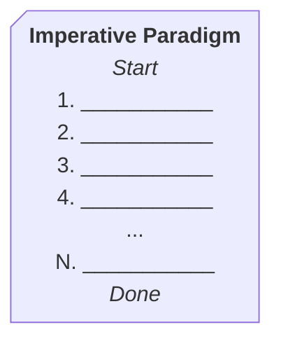

# Software Architecture

Until now, we've been thinking about programming in terms of syntax, logic, and language.

That is about to change.

_Metaphor:_ If we've been learning to lay bricks, now we're going to begin to think about architecture.

## Programming as a List of Steps

The following diagram represents the anatomy of most of the C++ programs we've written in this class. There is a starting point, some steps, and an end point. The entire program runs to completion.



This is a useful metaphor for a computer program: A list of steps.

However, this metaphor is **insufficient** to describe many processes that we'd like to represent in code. Some examples:

1. **A video game** — The user can send input from the controller at any time, but our code can only accept keyboard input when we use `cin`.

   ```mermaid
   stateDiagram-v2
        [*] --> Ready
        Ready --> Move : walk
        Ready --> Move : jump
        Move --> Ready
        Move --> Win : Touch Trophy
        Move --> Lose : Touch Lava
        Win --> [*]
        Lose --> [*]
   ```

1. **A social network** — Many users are sending & receiving content. How would we keep track of which user needs to receive what?

   ```mermaid
   erDiagram
       User ||--o{ User : "has friend"
       User ||--o{ Post : has
       User ||--o{ Photo : owns
       User ||--o{ Post : "sees friend's"
       User {
           string name
           string birthday
       }
       Post {
           string content
           date posted_on
       }
       Photo {
           string url
       }

   ```

1. **An Inventory System** — There can be many different items in a store's inventory we do not know all the properties in advance.

1. **An Operating System** — There are many different processes happening at once on a computer. How do they cooperate to share the CPU & memory?

_These systems require us to think about the **architecture** or **design** of software, not just what code to write._

## Object-Oriented Programming

There are different ways to think about software architecture: flow charts, diagrams, meetings, tests.

We are going to spend some time talking about one technique: **Object-Oriented Programming (OOP)**. We are going to focus on the the building blocks of OOP: classes & objects.

OOP is a way of thinking about the structure of a program by imagining "lego blocks" which can snap together to create the necessary functionality.

**We will now stop thinking about programming like a list of steps. Instead, we will think about:**

1. What are the requirements? (From the question, or wherever)
1. What "lego blocks" can snap together to make a system which does that?
1. How do I write code which creates those "lego blocks"?
