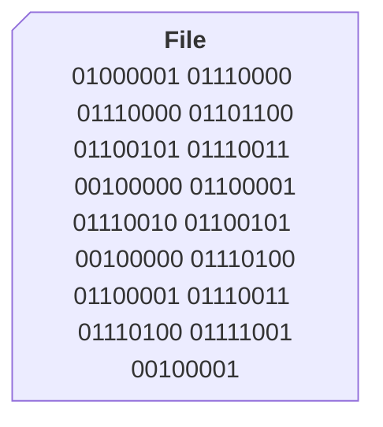
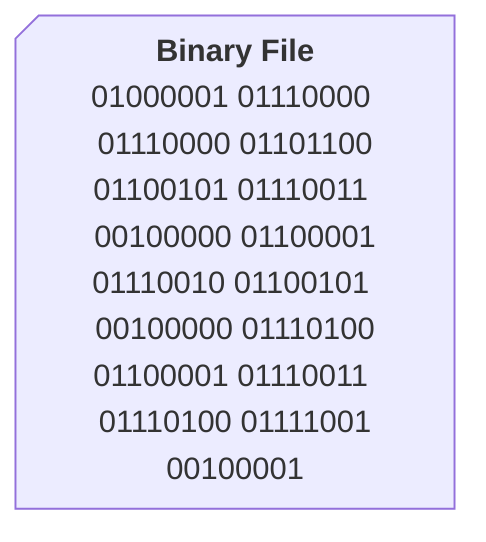
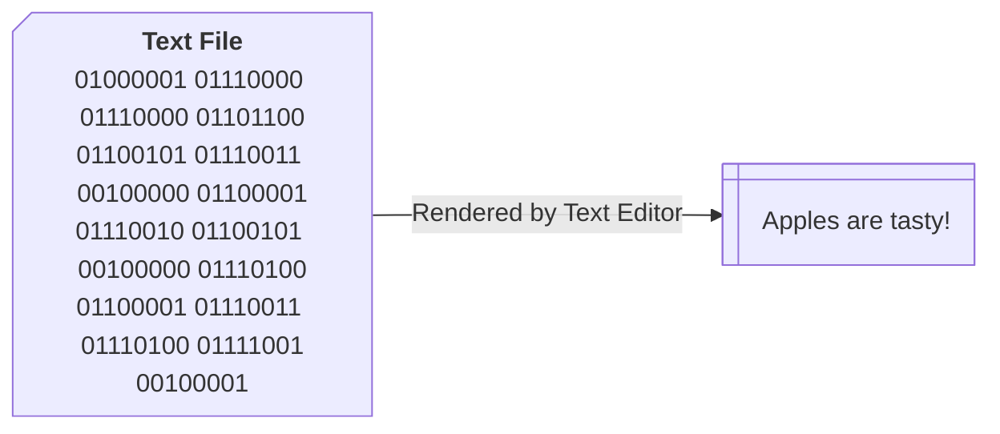
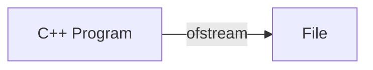
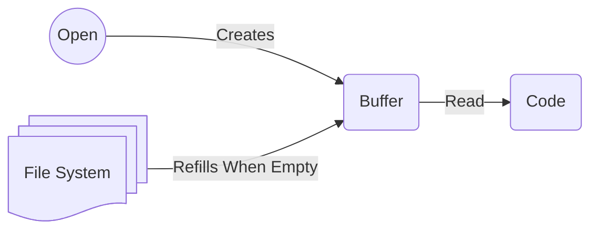
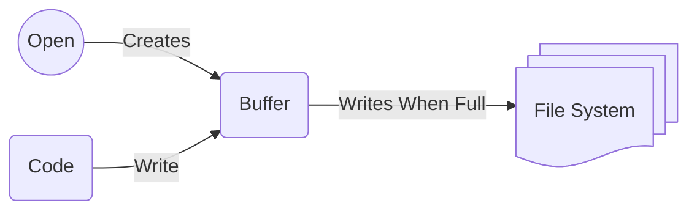

# File Input/Output

## What is IO?

_Input/Output is usually stylized as I/O or IO_

The concept of:

- Sending information from inside our program to an outside system
- Receiving information from an outside system and using it inside our program

We can send and receive information from many sources:

- Operating system
- Network
- Files
- Databases
- etc.

## Files

Files are units of data stored in the computer's file system. Files exist in most operating systems.

The concept of a file is based on the metaphor of a file cabinet. A file cabinet has folders which contain pieces of paper (files). The pieces of paper have writing on them (data).

Files have **data** and **attributes**.

### Data

Files contain a sequence of bytes, like `01000001 01110000 01110000 ...`. This is their data.



### Attributes

| Attribute     | Description                                                                                                                                 | Example                                              |
| ------------- | ------------------------------------------------------------------------------------------------------------------------------------------- | ---------------------------------------------------- |
| Filename      | The unique identifier of the file. Usually has an **extension** indicating the type of data the file contains.                              | pokemon.txt                                          |
| Size          | The number of bytes in the file                                                                                                             | 1,024 bytes                                          |
| Last Modified | The operating system keeps track of the date when the file was most recently changed                                                        | 28 Feb 2025 10:09 AM                                 |
| Permissions   | The operating system can allow only certain **users** or **processes** from accessing a file. Certain **operations** can be restricted too. | Allowed Users: admins; Allowed Operations: read-only |

### Binary vs. Text Files

There are two main types of files: binary and text files.

#### Binary

The contents of binary files are just their bytes, as-is. These files are not human-readable. Opening them in a text editor will result in meaningless characters.



##### Binary File Examples

| Category                | File types                    |
| ----------------------- | ----------------------------- |
| Images                  | `.jpg`, `.png`                |
| Audio                   | `.mp3`, `wav`                 |
| Video                   | `.mp4` `.mov`                 |
| Executable Machine Code | `.exe`, `.o`, or no extension |

#### Text File

The contents of a text file represent characters, according to an **encoding**, like ASCII or UTF-8. These files are human-readable. Opening a text file in a text editor will result in human-readable characters, because the text editor applies the encoding, transforming the bytes into characters.



##### Example Encoding

|  Binary  | Text  |
| :------: | :---: |
| 01000001 |   A   |
| 01110000 |   p   |
| 01110000 |   p   |
| 01101100 |   l   |
| 01100101 |   e   |
| 01110011 |   s   |
| 00100000 | space |
| 01100001 |   a   |
| 01110010 |   r   |
| 01100101 |   e   |
| 00100000 | space |
| 01110100 |   t   |
| 01100001 |   a   |
| 01110011 |   s   |
| 01110100 |   t   |
| 01111001 |   y   |
| 00100001 |   !   |

##### Text File Examples

| Category        | File types |
| --------------- | ---------- |
| XML             | `.xml`     |
| JSON            | `.json`    |
| Tab-Delimited   | `.tsv`     |
| Comma-Delimited | `.csv`     |
| Unstructured    | `.txt`     |

## File IO

File IO is implemented with streams. Why might file IO be implemented with streams?

- **Reduced Memory Use** — Reading an entire file into memory is often unnecessary. Streams let us examine just one "chunk" at a time, saving memory.
- **Speed** — Reading an entire file at once could be very slow, especially if the file is massive. Streams let us control the amount we read, saving time.

### Implementation

Provided by `fstream` in the C++ Standard Library. The functionality is separated into two classes:

1. `ifstream` — Input File Stream
1. `ofstream` — Output File Stream

#### `ifstream`

`ifstream` is a **stream** for reading input from a file.

```
input file stream
i     f    stream   →  ifstream
```


#### `ofstream`

`ofstream` is a **stream** for writing output to a file.

```
output file stream
o      f    stream  →  ofstream
```



### Example

```cpp
#include <fstream> // include fstream
using namespace std;

int main() {
    // ifstream & ofstream are now available for use
    ifstream variable_name;
    ofstream another_variable_name;
}
```

### Quiz

1. Which stream can work with the operating system IO?

   Answer: `cin` & `cout`

1. Which streams can work with file IO?

   Answer: `ifstream` & `ofstream`

1. Which manipulators can affect the `cin` & `cout` streams?

   Answer:

   - Make tables with `setw(n)`,`left`,`right`,`setfill(c)`
   - Format Decimals with `setprecision(n)`,`fixed`,`scientific`,`showpoint`
   - Affect the Buffer with `endl`,`flush`

1. Which manipulators can affect the `ifstream` & `ofstream` streams?

   Answer: _The same ones!_

   This is a benefit of the stream concept. The same techniques can be shared among different streams, reusing your existing knowledge.

## Reading & Writing Files

### How to **Read** a Text File

1. Allocate an `ifstream`
1. Open the file with its name
1. Read the file with stream functions
1. Close the file

### How to **Write** a Text File

1. Allocate an `ofstream`
1. Open the file with its name
1. Write to the the file with stream functions
1. Close the file

### `ifstream` Interface

| Method                        | Use                                                                      |
| ----------------------------- | ------------------------------------------------------------------------ |
| `.open(s)`                    | Open a file by file name (string)                                        |
| `.is_open()`                  | Whether the `.open(s)` action was successful                             |
| `.fail()`                     | Whether the most recent "read" action was successful                     |
| `.close()`                    | Close the connection to the file                                         |
| `ifstream >> variable`        | Extract file contents into the variable, stopping at the next whitespace |
| `getline(ifstream, variable)` | Extract file contents into the variable, stopping at the next newline    |

[zyBook Table 10.3.1: Stream error state flags and functions to check error state](https://learn.zybooks.com/zybook/HARDINGCOMP1510McCownSpring2025/chapter/10/section/3?content_resource_id=108375069)

## Reading a Text File

Read pokemon.txt into a `vector<string>`

`pokemon.txt`

```txt
Bulbasaur
Charmander
Squirtle
```

`main.cpp`

```cpp
#include <string>
#include <fstream>

int main() {
    // Input Stream entity. It "streams" the contents of the file.
    ifstream pokemonFS;

    // Open the file by filename
    pokemonFS.open("pokemon.txt");

    // To hold each line, one at a time
    string line;

    // Read each line of the file
    while (pokemonFS >> line /* getline(pokemonFS, line) */) {
        // ...
    }

    // Close the file
    pokemonFS.close();
}
```

### Choosing the “Chunk”

```cpp
fileFS >> line        // reads until next whitespace
```

```cpp
getline(fileFS, line) // reads until next newline
```

### Analysis

#### How does this work?

- `ifstream` provides an interface to access the file system, and process the text file.

- `line` provides a "container" to store each piece of the file as a string, as it is "streamed".

- `while` loops until (implicit) call to `.fail()` returns true, either because there is nothing left to read or an error occurred.

#### Why does it work?

What type of expression does `while` expect?

```cpp
while(pokemonFS >> line) { /* ... */ }
```

`while` expects a boolean.

- `>>` and `getline()` both return a reference to the stream.
- `ifstream` can be converted into a `bool` implicitly by the compiler.
- The result of the `.fail()` method is automatically.
- Trying to read after end-of-file is reached causes `.fail()` to return true.
- Therefore, the `while` loop ends when a read is attempted after end-of-file is reached.

Other Resources:

- [Deep Dive into error checking an `ifstream`](https://gehrcke.de/2011/06/reading-files-in-c-using-ifstream-dealing-correctly-with-badbit-failbit-eofbit-and-perror/)

### Another Option

We can also call `.fail()` directly to stop reading at end-of-file, but we must do the checks in a certain order.

This approach is not recommended because it is easy to get the operations out of order by mistake.

```cpp
// We must read the first line before starting the loop
pokemonFS >> line;

// Check if read failed in the previous loop
while(!pokemonFS.fail()) {

    cout << line;

    // We must read another chunk only after using line
    pokemonFS >> line;
}
```

## Writing a Text File

Let's extend the program above to copy the text input file, adding line numbers. Use the insertion operator `<<` to insert into an `ofstream`.

`pokemon.txt`

```txt
Bulbasaur
Charmander
Squirtle
```

`main.cpp`

```cpp
#include <fstream>
using namespace std;

int main() {
    ifstream fin;
    ofstream fout; // Open the output file, too

    // Open both files by filename
    fin.open("pokemon.txt");              // input file
    fout.open("pokemon-with-numbers.txt"); // output file

    string line;
    int number = 0;
    // Read each line of the input file
    while (getline(fin, line)) {
        number += 1;
        fout << number << ". " << line << endl;
    }

    // Close both files
    fin.close();  // input file
    fout.close(); // output file
}
```

### Write Modes

By default, writing to an `ofstream` will overwrite the contents of the file. We can change that behavior by providing a second argument to the open method.

```cpp
// Overwrite contents
fout.open("filename.txt");
```

```cpp
// Append each write
fout.open("filename.txt", ios::app);
```

#### Append to File Exercise

Extend the Program above to append the contents of `pokemon-chunk.txt` to the output file. **Note:** Each time we run the code, the contents of `pokemon-chunk.txt` will be appended again.

What will be the expected output, given the following files?
`pokemon.txt`

```txt
Bulbasaur
Charmander
Squirtle
```

`pokemon-chunk.txt`

```txt
Caterpie
Metapod
```

What will be the expected output if we run the code again?

## `ifstream` & `ofstream` in Functions

File streams can be passed into functions as arguments. This is useful for _abstracting_ logic into a function for reuse.

File streams must be passed by **reference.**

Why?
`ifstream` & `ofstream` are [not copyable](https://cplusplus.com/reference/fstream/ifstream/ifstream/) because streams are intended to exist once and be shared throughout your code. Passing by value would require making a copy.

### Syntax

```cpp
// Adds all numbers in the file stream
int sum(ifstream &fin) {
    int num;
    int sum = 0;
    while (fin >> num) {
        sum += num;
    }
    return sum;
}
```

## Buffers

Writing and reading files in the underlying operating system is slow. File streams increase utilizing a buffer to batch the reads and writes made by our code. This has two benefits:

1. Increased read & write speed
1. Increased disk life. Each write to the file system is one step closer to the disk wearing out.

### Reading

- Opening the file creates a buffer & fills it up with the first chunk of the file.
- Reading moves the data from the buffer to the destination in your code.
- The buffer "automatically" refills itself when it needs to supply more data but it is already empty.



### Writing

- Opening the file for writing creates an empty buffer.
- Writing streams data from your code into the buffer.
- The Buffer is written to disk each time it becomes full. Closing the file writes the remaining contents of the buffer to disk, if any.



## Errors

There are several errors which can happen when working with file streams.

### Summary

| Problem                   | Solution                                      |
| ------------------------- | --------------------------------------------- |
| Nonexistent File          | `.is_open()`                                  |
| Improper Variable Type    | Don't make mistakes ☹️                        |
| Reading Past EOF          | Stop reading when `.fail() == true`           |
| Overwriting Existing File | Detect whether the file exists before writing |

### **Problem:** Opening a file which does not exist

A file with the provided name might not exist, or the code may be denied access. Check that the file is open with `.is_open()` before reading.

```cpp
ifstream pokemonFS;
string line;

// Mistake in filename
string filename = "pokem0n.txt";
pokemonFS.open(filename);

// Evaluates to `false`!
while (pokemonFS >> line) {
    // ...
}

// Proceeds without reading any file contents...

```

Fixed by terminating the program if the file could not be opened.

```cpp
ifstream pokemonFS;
string line;

// Mistake in filename
string filename = "pokem0n.txt";
pokemonFS.open(filename);

// Terminate application, since we can't do anything useful without the file
if (!pokemonFS.is_open()) {
    cout << "Could not open file " + filename ". Does it exist?";
    return 1;
}

while (pokemonFS >> line) {
    // ...
}
```

### **Problem:** Assigning data to a variable which cannot hold the data

If we assign content to a variable which cannot hold it, there will be an error.

```cpp
ifstream fin;
int num;

// ❌ getline() returns string, which cannot be assigned to num
while (getline(fin, num)) {
    //...
}
```

Fixed by storing into a variable with the right type.

```cpp
ifstream fin;
int num;

// ✅ The Extraction operator can convert the characters into an `int`
while (fin >> num) {
    //...
}
```

### **Problem:** Trying to read when there is nothing left

If we attempt to read when there is nothing to read, logic errors will result. We must check if the read was successful each time, before using the data. Stop reading at the end-of-file. Use an idiom which handles EOF and errors. See discussion above.

#### Example

`pokemon.txt`

```txt
Bulbasaur
Charmander
Squirtle
```

`main.cpp`

```cpp
ifstream pokemonFS;
string bulbasaur;
string charmander;
string squirtle;
string caterpie;

pokemonFS >> bulbasaur;
pokemonFS >> charmander;
pokemonFS >> squirtle;
pokemonFS >> caterpie; // ❌ No 4th chunk!
```

Fixed by looping until end-of-file

```cpp
string line;
while(pokemonFS >> line) { /* ... */ }
```

### **Problem:** Accidentally Overwriting an existing File

Writing to a file will overwrite any existing file with the same name. A programmer can detect whether a given already file exists by attempting to read the file, then checking `.fail()`.

```cpp
// I hope this does not already exist
const string filename = "receipt.txt";

ifstream does_it_exist;
string trash_can;

// Try to open the file and read a line
does_it_exist.open(filename);
does_it_exist >> trash_can;

if (does_it_exist.fail())
{
    // File is empty or does not exist. It is safe to write
    ofstream fout;
    fout.open(filename);
    fout << "very important data";
    fout.close();
}
else
{
    cout << "File " << filename << " already exists!" << endl;
}
```

## Appendix: Example Programs

### Read a TSV File

```txt
Number	Name	Type
1	Bulbasaur	Grass/Poison
2	Ivysaur	Grass/Poison
3	Venusaur	Grass/Poison
4	Charmander	Fire
5	Charmeleon	Fire
6	Charizard	Fire/Flying
7	Squirtle	Water
8	Wartortle	Water
9	Blastoise	Water
10	Caterpie	Bug
11	Metapod	Bug
12	Butterfree	Bug/Flying
```

```cpp
#include <string>
#include <vector>
#include <fstream>
#include <iostream>
using namespace std;

vector<string> parse_tsv_row(string &row, char separator = '\t')
{
    vector<string> out;
    int start = 0;
    int found = 0;
    while (found != -1)
    {
        found = row.find(separator, start);
        string column = row.substr(start, found - start);
        start = found + 1;

        out.push_back(column);
    }
    return out;
}

const string TSV_FILENAME = "pokemon.tsv";
const string SEARCH_TYPE = "Fire";
const int TSV_INDEX_FOR_TYPE = 2;

int main()
{
    ifstream fin;
    string line;

    // Output
    int count = 0;

    // Open file
    fin.open(TSV_FILENAME);

    // Discard Titles row
    getline(fin, line);

    // Count each row where type is "grass"
    while (getline(fin, line))
    {
        // Parse Each TSV Row
        vector<string> data = parse_tsv_row(line);

        // Access "Type" column
        string type = data.at(TSV_INDEX_FOR_TYPE);
        // Determine if the Pokémon has the type we are searching for
        if (type.find(SEARCH_TYPE) != -1)
        {
            count += 1;
        }
    }

    cout << "Found " << count << ' ' << SEARCH_TYPE << "-type Pokémon" << endl;
}
```
